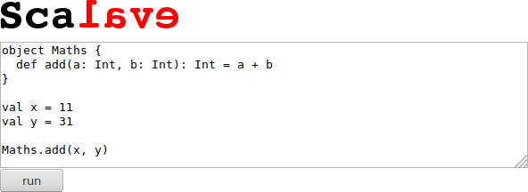

# Scalave

[](https://travis-ci.org/earldouglas/scalave)
[](https://coveralls.io/r/earldouglas/scalave)

## Demo

[](https://scalave.herokuapp.com/)

## Usage

To embed Scalave on your site, add the following snippet:

```html
<script src="//scalave.herokuapp.com/scalave.js"></script>
```

To provide default Scala code, simply include it within the `script`
element:

```html
<script rows="8" cols="72" src="//scalave.herokuapp.com/scalave.js">

  object Maths {
    def add(a: Int, b: Int): Int = a + b
  }

  val x = 11
  val y = 31

  Maths.add(x, y)

</script>
```
